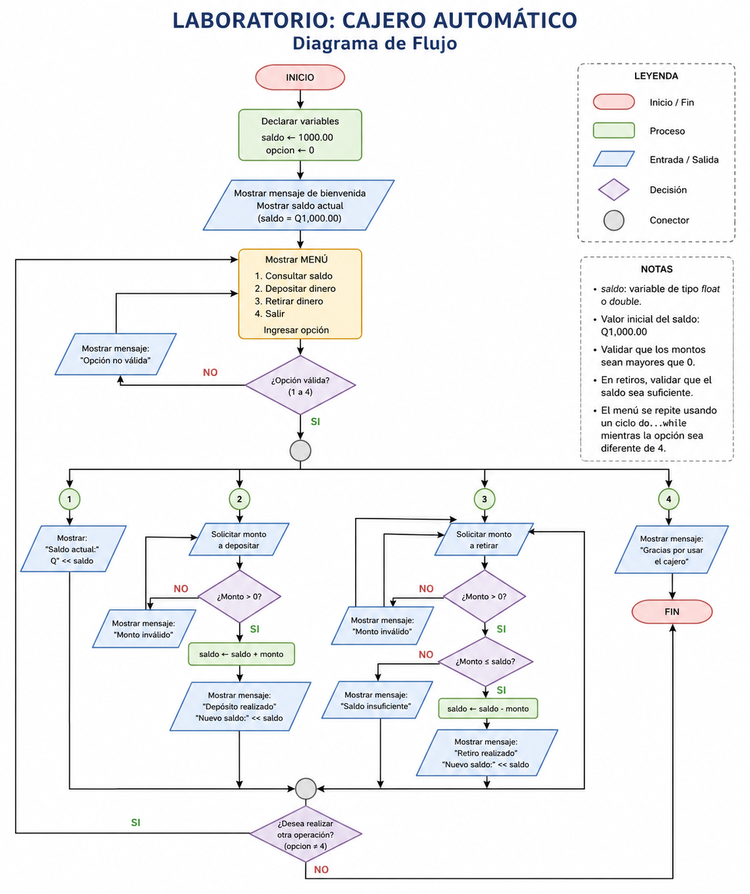

# Laboratorio No. 3: ciclos, `enum` y simulación de un cajero automático

## Propósito del laboratorio

En este laboratorio repasaremos brevemente las estructuras que ya conocemos y construiremos un programa completo que combine decisiones, repetición y opciones de menú.

Al finalizar, el estudiante podrá:

- reconocer cuándo utilizar `if`, `switch`, `while`, `for` y `do...while`;
- construir ciclos `for` para repeticiones conocidas;
- representar opciones mediante un tipo enumerado `enum`;
- integrar un menú repetitivo con `switch` y `do...while`;
- validar depósitos y retiros en una simulación de cajero automático.

::: {.callout-note title="Duración total"}
**80 minutos.** El propósito no es estudiar muchas estructuras nuevas, sino aprender a combinarlas en un programa claro y funcional.
:::

## Ruta de trabajo

| Momento | Actividad | Tiempo |
|---|---|---:|
| 1 | Recordatorio de estructuras básicas | 10 min |
| 2 | Ciclo `for`: explicación y ejercicios | 15 min |
| 3 | Uso de `enum` | 10 min |
| 4 | Construcción del cajero automático | 40 min |
| 5 | Prueba y cierre | 5 min |

---

## Recordatorio rápido

Un programa puede imaginarse como una persona que sigue instrucciones:

- una **secuencia** indica qué hacer paso a paso;
- una **decisión** permite escoger entre varios caminos;
- un **ciclo** permite repetir una actividad;
- un **menú** reúne varias operaciones y espera la selección del usuario.

### Estructura secuencial

Las instrucciones se ejecutan en el mismo orden en que aparecen.

```cpp
#include <iostream>
using namespace std;

int main() {
    int numero1, numero2, suma;

    cout << "Ingrese el primer numero: ";
    cin >> numero1;

    cout << "Ingrese el segundo numero: ";
    cin >> numero2;

    suma = numero1 + numero2;

    cout << "La suma es: " << suma << endl;

    return 0;
}
```

**Analogía:** preparar café implica seguir una secuencia: calentar agua, agregar café, servir y endulzar.

### Decisión con `if`

`if` se utiliza cuando una acción depende de una condición.

```cpp
if (edad >= 18) {
    cout << "Es mayor de edad." << endl;
} else {
    cout << "Es menor de edad." << endl;
}
```

**Analogía:** antes de salir, una persona observa el clima. Si está lloviendo, lleva paraguas; de lo contrario, sale sin él.

### Selección múltiple con `switch`

`switch` es útil cuando una variable puede representar varias opciones concretas.

```cpp
switch (opcion) {
    case 1:
        cout << "Consultar saldo" << endl;
        break;

    case 2:
        cout << "Depositar" << endl;
        break;

    case 3:
        cout << "Retirar" << endl;
        break;

    default:
        cout << "Opcion no valida" << endl;
}
```

::: {.callout-warning title="¿Para qué sirve break?"}
`break` detiene el `switch` después de ejecutar el caso seleccionado. Sin él, el programa puede continuar ejecutando los casos siguientes.
:::

### Repetición con `while`

`while` repite un bloque mientras una condición sea verdadera.

```cpp
int contador = 1;

while (contador <= 5) {
    cout << contador << endl;
    contador++;
}
```

**Analogía:** mientras todavía haya platos sucios, se continúa lavando.

---

## Ciclo `for`

El ciclo `for` se utiliza principalmente cuando conocemos cuántas veces debe repetirse una acción.

```cpp
for (inicializacion; condicion; actualizacion) {
    // instrucciones que se repiten
}
```

En el siguiente ejemplo:

```cpp
for (int i = 1; i <= 5; i++) {
    cout << i << endl;
}
```

ocurre lo siguiente:

1. `int i = 1` crea e inicializa el contador.
2. `i <= 5` determina si el ciclo continúa.
3. `i++` aumenta el contador después de cada repetición.

**Analogía:** recorrer cinco escritorios para entregar una hoja. Se conoce desde el inicio cuántos escritorios deben visitarse.

### Ejercicio 1: mostrar los números del 1 al 10

Complete y ejecute el siguiente programa:

```cpp
#include <iostream>
using namespace std;

int main() {
    for (int i = 1; i <= 10; i++) {
        cout << i << " ";
    }

    cout << endl;
    return 0;
}
```

### Ejercicio 2: tabla de multiplicar

Construya un programa que solicite un número y muestre su tabla de multiplicar del 1 al 10.

```cpp
#include <iostream>
using namespace std;

int main() {
    int numero;

    cout << "Ingrese un numero: ";
    cin >> numero;

    for (int i = 1; i <= 10; i++) {
        cout << numero << " x " << i
             << " = " << numero * i << endl;
    }

    return 0;
}
```

::: {.callout-tip title="Pregunta para el grupo"}
¿Qué parte del ciclo habría que modificar para mostrar la tabla únicamente del 1 al 5?
:::

---

## Uso de `enum`

Un `enum` permite asignar nombres claros a un conjunto de valores relacionados.

```cpp
enum Dia {
    LUNES = 1,
    MARTES,
    MIERCOLES,
    JUEVES,
    VIERNES
};
```

Internamente, los valores continúan siendo números, pero el código resulta más fácil de leer.

**Analogía:** en lugar de identificar las luces de un semáforo como `0`, `1` y `2`, podemos llamarlas `ROJO`, `AMARILLO` y `VERDE`.

```cpp
#include <iostream>
using namespace std;

enum EstadoSemaforo {
    ROJO = 1,
    AMARILLO,
    VERDE
};

int main() {
    int opcion;

    cout << "1. Rojo" << endl;
    cout << "2. Amarillo" << endl;
    cout << "3. Verde" << endl;
    cout << "Seleccione el estado: ";
    cin >> opcion;

    switch (opcion) {
        case ROJO:
            cout << "Detenerse." << endl;
            break;

        case AMARILLO:
            cout << "Prepararse para detenerse." << endl;
            break;

        case VERDE:
            cout << "Puede avanzar." << endl;
            break;

        default:
            cout << "Estado no valido." << endl;
    }

    return 0;
}
```

### Ventaja principal

Compare estas dos expresiones:

```cpp
if (opcion == 3)
```

```cpp
if (opcion == VERDE)
```

La segunda comunica mejor la intención del programa.

---

## Proyecto del laboratorio: cajero automático

### Situación

Un cajero automático presenta un menú y espera que el usuario seleccione una operación. Después de consultar, depositar o retirar, el menú vuelve a mostrarse. El programa termina únicamente cuando se selecciona **Salir**.

### Operaciones requeridas

1. Consultar saldo.
2. Depositar dinero.
3. Retirar dinero.
4. Salir.

El saldo inicial será de **Q1,000.00**.

### Reglas

- Los depósitos deben ser mayores que cero.
- Los retiros deben ser mayores que cero.
- No se puede retirar una cantidad superior al saldo disponible.
- El menú debe repetirse hasta seleccionar la opción de salida.
- Las opciones se representarán mediante `enum`.
- El menú se controlará con `switch`.
- La repetición se realizará con `do...while`.

## 4.1 ¿Por qué utilizar `do...while`?

El cajero debe mostrar el menú por lo menos una vez. Por ello, `do...while` es apropiado: primero ejecuta las instrucciones y luego evalúa si debe repetirlas.

```cpp
do {
    // instrucciones
} while (condicion);
```

**Analogía:** al llegar a un cajero, primero se observa el menú. Después de realizar una operación se decide si se hará otra o si se terminará.

## Diseño previo

Antes de programar, identifique las partes principales:

```text
Inicio
  Definir saldo inicial
  Definir las opciones del menu

  Hacer
    Mostrar menu
    Leer opcion

    Segun la opcion
      Consultar saldo
      Depositar
      Retirar
      Salir
      Informar opcion invalida
  Mientras la opcion no sea Salir
Fin
```
## Diagrama de flujo

{width=90%}

## Definición de las opciones con `enum`

```cpp
enum OpcionCajero {
    CONSULTAR_SALDO = 1,
    DEPOSITAR,
    RETIRAR,
    SALIR
};
```

Como el primer valor es `1`, los siguientes toman automáticamente los valores `2`, `3` y `4`.

## Construcción paso a paso

### Paso 1: variables principales

```cpp
double saldo = 1000.00;
double monto;
int opcion;
```

### Paso 2: mostrar el menú

```cpp
cout << "\n===== CAJERO AUTOMATICO =====" << endl;
cout << "1. Consultar saldo" << endl;
cout << "2. Depositar dinero" << endl;
cout << "3. Retirar dinero" << endl;
cout << "4. Salir" << endl;
cout << "Seleccione una opcion: ";
cin >> opcion;
```

### Paso 3: procesar la opción

```cpp
switch (opcion) {
    case CONSULTAR_SALDO:
        cout << "Saldo disponible: Q" << saldo << endl;
        break;

    case DEPOSITAR:
        // solicitar y validar el deposito
        break;

    case RETIRAR:
        // solicitar y validar el retiro
        break;

    case SALIR:
        cout << "Gracias por utilizar el cajero." << endl;
        break;

    default:
        cout << "Opcion no valida." << endl;
}
```

### Paso 4: repetir el menú

```cpp
do {
    // mostrar menu y procesar opcion
} while (opcion != SALIR);
```

---

## 5. Programa completo

```cpp
#include <iostream>
#include <iomanip>
using namespace std;

enum OpcionCajero {
    CONSULTAR_SALDO = 1,
    DEPOSITAR,
    RETIRAR,
    SALIR
};

int main() {
    double saldo = 1000.00;
    double monto;
    int opcion;

    cout << fixed << setprecision(2);

    do {
        cout << "\n===== CAJERO AUTOMATICO =====" << endl;
        cout << "1. Consultar saldo" << endl;
        cout << "2. Depositar dinero" << endl;
        cout << "3. Retirar dinero" << endl;
        cout << "4. Salir" << endl;
        cout << "Seleccione una opcion: ";
        cin >> opcion;

        switch (opcion) {
            case CONSULTAR_SALDO:
                cout << "Saldo disponible: Q" << saldo << endl;
                break;

            case DEPOSITAR:
                cout << "Ingrese el monto a depositar: Q";
                cin >> monto;

                if (monto > 0) {
                    saldo = saldo + monto;
                    cout << "Deposito realizado correctamente." << endl;
                    cout << "Nuevo saldo: Q" << saldo << endl;
                } else {
                    cout << "El monto debe ser mayor que cero." << endl;
                }
                break;

            case RETIRAR:
                cout << "Ingrese el monto a retirar: Q";
                cin >> monto;

                if (monto <= 0) {
                    cout << "El monto debe ser mayor que cero." << endl;
                } else if (monto > saldo) {
                    cout << "Fondos insuficientes." << endl;
                } else {
                    saldo = saldo - monto;
                    cout << "Retiro realizado correctamente." << endl;
                    cout << "Nuevo saldo: Q" << saldo << endl;
                }
                break;

            case SALIR:
                cout << "Gracias por utilizar el cajero automatico." << endl;
                break;

            default:
                cout << "Opcion no valida. Intente nuevamente." << endl;
        }

    } while (opcion != SALIR);

    return 0;
}
```

## Pruebas del programa

Antes de considerar terminado el ejercicio, pruebe por lo menos los siguientes casos:

| Prueba | Acción | Resultado esperado |
|---|---|---|
| 1 | Consultar al iniciar | Mostrar Q1,000.00 |
| 2 | Depositar Q500.00 | Nuevo saldo Q1,500.00 |
| 3 | Retirar Q300.00 | Nuevo saldo Q1,200.00 |
| 4 | Retirar más que el saldo | Mostrar fondos insuficientes |
| 5 | Depositar un número negativo | Rechazar el monto |
| 6 | Seleccionar una opción inexistente | Mostrar opción no válida |
| 7 | Seleccionar Salir | Finalizar el ciclo |

::: {.callout-important title="Idea clave"}
Un programa no está terminado solamente porque compila. También debe probarse con datos correctos, incorrectos y casos límite.
:::

## Reto opcional

Cuando el programa básico funcione, agregue **una** de las siguientes mejoras:

- solicitar un PIN antes de mostrar el menú;
- contar cuántas operaciones se realizaron;
- establecer un retiro máximo por operación;
- mostrar un mensaje cuando el saldo sea menor que Q100.00.

## Cierre

En el cajero automático se combinaron varias estructuras:

- `enum` dio nombres a las opciones;
- `switch` seleccionó la operación;
- `if` validó depósitos y retiros;
- `do...while` mantuvo activo el menú;
- las variables almacenaron el saldo y los montos.

El valor del ejercicio no está únicamente en hacer funcionar un cajero, sino en comprender cómo varias estructuras pequeñas pueden integrarse para resolver un problema completo.
