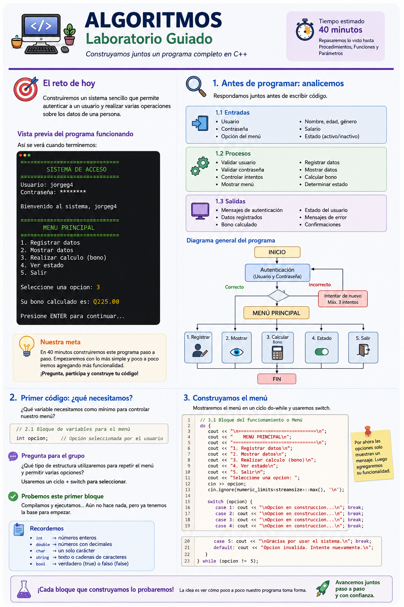
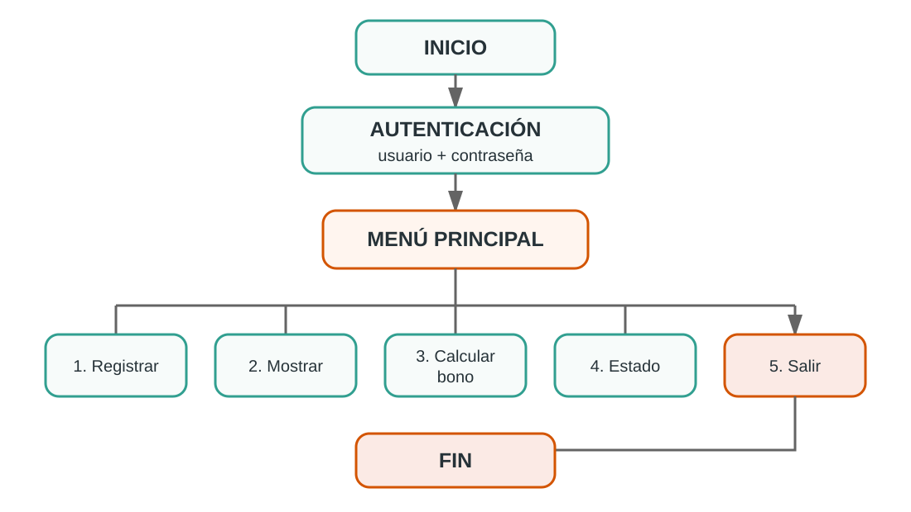
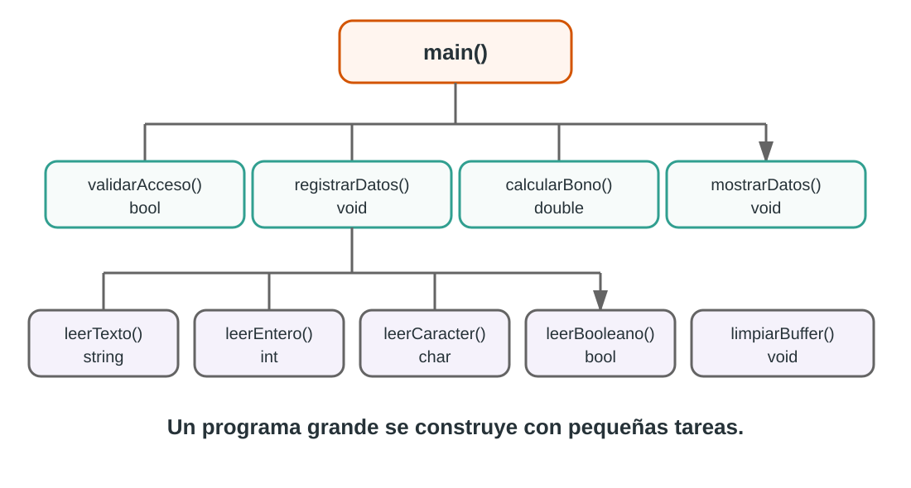

# El reto de hoy

Una pequeña empresa necesita un programa en C++ para **controlar el acceso a un sistema y registrar información básica de una persona**.

Para ingresar, el usuario deberá proporcionar un **nombre de usuario y una contraseña**. El sistema deberá comprobar que las credenciales sean correctas y permitirá un máximo de **tres intentos**. Si los tres intentos son incorrectos, el acceso será bloqueado y el programa finalizará.

Cuando el acceso sea correcto, el sistema mostrará un menú con las siguientes opciones:

1. Registrar datos.
2. Mostrar los datos registrados.
3. Calcular un bono.
4. Consultar el estado de la persona.
5. Salir.

Para registrar a una persona se solicitará:

- nombre completo;
- edad;
- género;
- salario;
- estado activo o inactivo.

El programa deberá **validar las entradas** para evitar datos incorrectos. Por ejemplo, no deberá aceptar texto cuando se espera un número ni valores diferentes a los permitidos en las opciones que correspondan.

Para calcular el bono se utilizarán las siguientes reglas:

- si la persona tiene menos de 50 años, el bono será del **5 % del salario**;
- si tiene 50 años o más, el bono será del **10 % del salario**.

El menú deberá permanecer disponible hasta que el usuario decida salir.

::: {.callout-important}
## Antes de escribir código

Leamos el problema y respondamos entre todos:

1. ¿Cuáles son las **entradas**?
2. ¿Cuáles son los **procesos**?
3. ¿Cuáles son las **salidas**?
4. ¿Qué **tipos de variables** necesitaremos?
5. ¿Dónde tendremos que tomar **decisiones**?
6. ¿Qué partes deberán **repetirse**?

**Todavía no programemos. Primero entendamos qué debemos construir.**
:::

# 1. Comprobemos nuestro análisis

Ahora sí, comparemos nuestras respuestas con una representación general de la solución.

**¿Contemplamos todo? ¿Qué nos hizo falta?**

## Veamos el problema completo

{fig-alt="Panorama visual del laboratorio guiado de Algoritmos" width="95%"}

::: {.callout-note}
## Comparemos

Observemos la infografía y revisemos nuestras respuestas:

- ¿Identificamos todos los datos que necesita el programa?
- ¿Reconocimos que necesitaremos validaciones?
- ¿Detectamos que habrá un menú?
- ¿Pensamos en funciones y procedimientos?
- ¿Qué elemento no habíamos considerado?
:::

## Ahora veamos el flujo de la solución

La infografía nos muestra **qué construiremos**.

El diagrama de flujo nos ayudará ahora a comprender **cómo funcionará**.

{fig-alt="Flujo general del sistema desde autenticación hasta las opciones del menú" width="92%"}

::: {.callout-tip}
## Observemos el diagrama

Antes de continuar, identifiquemos:

- dónde inicia el programa;
- qué debe ocurrir antes de mostrar el menú;
- dónde existen decisiones;
- qué partes se repiten;
- cuándo termina el programa.

Con el problema entendido, **ahora sí comenzamos a construir código**.
:::

# 2. Primer código: ¿qué necesitamos para controlar el menú?

::: {.callout-note}
## Pregunta para el grupo

Si todavía no hemos construido ninguna funcionalidad, ¿qué variable necesitamos como mínimo para saber qué opción seleccionó el usuario?
:::

```cpp
int opcion;
```

Recordemos:

| Tipo | Uso |
|---|---|
| `int` | números enteros |
| `double` | números con decimales |
| `char` | un carácter |
| `string` | texto |
| `bool` | verdadero o falso |

# 3. Construyamos el menú

**Preguntemos:**

1. ¿Qué estructura permite repetir instrucciones?
2. ¿Qué estructura permite elegir entre varias opciones?
3. ¿Cuándo debe terminar nuestro menú?

Primera versión:

```cpp
#include <iostream>
using namespace std;

int main() {

    int opcion;

    do {
        cout << "\n==============================" << endl;
        cout << "        MENU PRINCIPAL" << endl;
        cout << "==============================" << endl;
        cout << "1. Registrar datos" << endl;
        cout << "2. Mostrar datos" << endl;
        cout << "3. Realizar calculo (bono)" << endl;
        cout << "4. Ver estado" << endl;
        cout << "5. Salir" << endl;
        cout << "Seleccione una opcion: ";
        cin >> opcion;
        limpiarBuffer();

        switch (opcion) {
            case 1:
                cout << "\nOpcion en construccion..." << endl;
                break;
            case 2:
                cout << "\nOpcion en construccion..." << endl;
                break;
            case 3:
                cout << "\nOpcion en construccion..." << endl;
                break;
            case 4:
                cout << "\nOpcion en construccion..." << endl;
                break;
            case 5:
                cout << "\nGracias por usar el sistema." << endl;
                break;
            default:
                cout << "\nOpcion invalida." << endl;
        }

    } while (opcion != 5);

    return 0;
}
```

::: {.callout-success}
## Probemos este primer bloque

Compilemos y ejecutemos.

- ¿Se repite el menú?
- ¿Funciona cada `case`?
- ¿Qué ocurre si escribimos `9`?
- ¿Qué ocurre al seleccionar `5`?

Todavía no hace mucho, pero **ya tenemos una base funcional**.
:::

# 4. ¿Qué datos necesita la persona?

::: {.callout-note}
## Pregunta para el grupo

Si la opción 1 debe registrar información, ¿qué variables necesitamos y de qué tipo debería ser cada una?
:::

Como ahora utilizaremos variables de tipo `string`, agregamos una nueva librería **al inicio del programa**:

```cpp
#include <string>
```

Nuestra cabecera queda así:

```cpp
#include <iostream>
#include <string>

using namespace std;
```

Ahora, **dentro de `main()` y antes del `do...while` del menú**, agregamos las variables de la persona:

```cpp
string nombre;
int edad;
char genero;
double salario;
bool activo;
bool datosRegistrados = false;
```

**¿Para qué sirve `datosRegistrados`?**

Nos permitirá evitar que el usuario intente mostrar o calcular información antes de haber registrado los datos.

# 5. Provocamos un problema

Supongamos que hacemos esto:

```cpp
cout << "Ingrese edad: ";
cin >> edad;
```

Ahora escribamos:

```text
Ingrese edad: Jorge
```

::: {.callout-warning}
## ¿Qué ocurrió?

El programa esperaba un entero y recibió texto.

Entonces aparece una nueva necesidad:

**no podemos confiar en que todas las entradas serán correctas.**
:::

# 6. Construyamos nuestras validaciones

Antes de escribir las funciones de validación debemos preparar correctamente la parte superior de nuestro programa.

## 6.1 Actualicemos las librerías

Para las validaciones necesitaremos dos librerías nuevas:

```cpp
#include <limits>   // numeric_limits: ayuda a limpiar el buffer
#include <cctype>   // toupper: permite convertir caracteres a mayúscula
```

Hasta este momento, la cabecera de nuestro programa debe quedar así:

```cpp
#include <iostream>
#include <string>
#include <limits>
#include <cctype>

using namespace std;
```

::: {.callout-note}
## Pregunta para el grupo

Si las funciones de validación estarán escritas **después de `main()`**, ¿cómo sabrá C++ que existen cuando las llamemos desde el programa principal?
:::

Necesitamos declarar sus **prototipos** antes de `main()`.

Un prototipo le informa al compilador:

- el nombre de la función;
- el tipo de dato que devuelve;
- los parámetros que recibe.

Agregamos debajo de `using namespace std;`:

```cpp
// Prototipos de validación
void limpiarBuffer();
int leerEntero(string mensaje);
double leerDecimal(string mensaje);
string leerTexto(string mensaje);
char leerCaracter(string mensaje);
bool leerBooleano(string mensaje);
```

Nuestra estructura, por ahora, debe verse así:

```cpp
#include <iostream>
#include <string>
#include <limits>
#include <cctype>

using namespace std;

// Prototipos de validación
void limpiarBuffer();
int leerEntero(string mensaje);
double leerDecimal(string mensaje);
string leerTexto(string mensaje);
char leerCaracter(string mensaje);
bool leerBooleano(string mensaje);

int main() {

    // Variables y menú...

    return 0;
}

// Aquí escribiremos las funciones completas
```

::: {.callout-important}
## Regla que utilizaremos desde ahora

Cada vez que creemos una nueva función o procedimiento que estará escrito después de `main()`, primero agregaremos su **prototipo** en la parte superior.

Así podremos **compilar y probar cada bloque** antes de continuar.
:::

## 6.2 Procedimiento para limpiar el buffer

```cpp
void limpiarBuffer() {
    cin.clear();
    cin.ignore((numeric_limits<streamsize>::max)(), '\n');
}
```

**Preguntemos:**

- ¿Recibe parámetros? → No.
- ¿Devuelve un valor? → No.
- ¿Realiza una tarea? → Sí.

Por eso utilizamos `void`.

## 6.3 Validar un entero

```cpp
int leerEntero(string mensaje) {
    int valor;

    while (true) {
        cout << mensaje;

        if (cin >> valor) {
            limpiarBuffer();
            return valor;
        }

        cout << "Error: debe ingresar un numero entero." << endl;
        limpiarBuffer();
    }
}
```

**Preguntemos:**

- ¿Qué recibe? → un `string`.
- ¿Cómo se llama ese dato recibido? → **parámetro**.
- ¿Qué devuelve? → un `int`.

## 6.4 Validar un decimal

```cpp
double leerDecimal(string mensaje) {
    double valor;

    while (true) {
        cout << mensaje;

        if (cin >> valor) {
            limpiarBuffer();
            return valor;
        }

        cout << "Error: debe ingresar un numero valido." << endl;
        limpiarBuffer();
    }
}
```

## 6.5 Validar texto

```cpp
string leerTexto(string mensaje) {
    string texto;

    do {
        cout << mensaje;
        getline(cin, texto);

        if (texto.empty()) {
            cout << "Error: el texto no puede estar vacio." << endl;
        }

    } while (texto.empty());

    return texto;
}
```

## 6.6 Validar un carácter

```cpp
char leerCaracter(string mensaje) {
    char valor;

    while (true) {
        cout << mensaje;
        cin >> valor;
        limpiarBuffer();

        valor = toupper(valor);

        if (valor == 'M' || valor == 'F') {
            return valor;
        }

        cout << "Error: ingrese M o F." << endl;
    }
}
```

## 6.7 Validar un valor lógico

En lugar de pedir al usuario que escriba `true` o `false`, utilizaremos una entrada más natural: **S/N**.

```cpp
bool leerBooleano(string mensaje) {
    char respuesta;

    do {
        cout << mensaje << " (S/N): ";
        cin >> respuesta;
        limpiarBuffer();

        respuesta = toupper(respuesta);

        if (respuesta != 'S' && respuesta != 'N') {
            cout << "Error: ingrese S o N." << endl;
        }

    } while (respuesta != 'S' && respuesta != 'N');

    return respuesta == 'S';
}
```

::: {.callout-tip}
## Observemos algo importante

`leerBooleano()` recibe un `string`, internamente utiliza un `char` y finalmente devuelve un `bool`.

¡Estamos conectando varios conceptos en una sola función!
:::

# 7. Hagamos funcionar la opción Registrar

Ya tenemos:

- las librerías necesarias;
- las variables;
- los prototipos de validación;
- y las funciones completas escritas después de `main()`.

Ahora sí podemos utilizarlas desde el menú sin que el compilador indique que son funciones desconocidas.

Reemplazamos el mensaje `"Opcion en construccion..."` del `case 1`.

```cpp
case 1:
    nombre = leerTexto("Nombre completo: ");
    edad = leerEntero("Edad: ");
    genero = leerCaracter("Genero (M/F): ");
    salario = leerDecimal("Salario: Q");
    activo = leerBooleano("Usuario activo");

    datosRegistrados = true;

    cout << "\nDatos registrados correctamente." << endl;
    break;
```

::: {.callout-success}
## Probemos otra vez

Intentemos deliberadamente:

- escribir letras en la edad;
- dejar vacío el nombre;
- escribir `X` en género;
- escribir texto en salario;
- responder algo diferente de `S` o `N`.

Nuestro programa ya empieza a defenderse de entradas incorrectas.
:::

# 8. ¿Llenamos `main()` de instrucciones?

Podríamos colocar todos los `cout` dentro del `case 2`.

Pero acabamos de aprender otra forma de organizar el programa.

Como vamos a crear un nuevo procedimiento y lo escribiremos después de `main()`, primero agregamos su prototipo junto a los anteriores:

```cpp
void mostrarDatos(string nombre, int edad, char genero,
                  double salario, bool activo);
```

::: {.callout-tip}
## Sigamos la misma regla

**Primero el prototipo → luego usamos el procedimiento → después escribimos su implementación completa.**
:::

::: {.callout-note}
## Pregunta para el grupo

Si una tarea solamente debe **mostrar información** y no necesitamos recibir un resultado, ¿podemos convertirla en un procedimiento?
:::

```cpp
void mostrarDatos(string nombre, int edad, char genero,
                  double salario, bool activo) {

    cout << "\n==============================" << endl;
    cout << "       DATOS REGISTRADOS" << endl;
    cout << "==============================" << endl;
    cout << "Nombre : " << nombre << endl;
    cout << "Edad   : " << edad << endl;
    cout << "Genero : " << genero << endl;
    cout << "Salario: Q" << salario << endl;
    cout << "Activo : " << (activo ? "Si" : "No") << endl;
}
```

Y nuestro `case 2` queda mucho más limpio:

```cpp
case 2:
    if (datosRegistrados) {
        mostrarDatos(nombre, edad, genero, salario, activo);
    }
    else {
        cout << "\nPrimero debe registrar los datos." << endl;
    }
    break;
```

# 9. Ahora necesitamos obtener un resultado

La opción 3 calculará un bono.

Antes de utilizar la nueva función agregamos su prototipo en la parte superior:

```cpp
double calcularBono(double salario, int edad);
```

Regla sencilla:

- edad menor de 50 años → 5 %;
- edad de 50 años o más → 10 %.

::: {.callout-note}
## Pregunta para el grupo

¿Procedimiento o función?

Necesitamos que el cálculo nos **devuelva un valor**, por lo que construiremos una función.
:::

```cpp
double calcularBono(double salario, int edad) {

    double porcentaje;

    if (edad >= 50) {
        porcentaje = 0.10;
    }
    else {
        porcentaje = 0.05;
    }

    return salario * porcentaje;
}
```

Ahora el `case 3`:

```cpp
case 3:
    if (datosRegistrados) {
        double bono = calcularBono(salario, edad);
        cout << "\nBono calculado: Q" << bono << endl;
    }
    else {
        cout << "\nPrimero debe registrar los datos." << endl;
    }
    break;
```

# 10. Consultemos el estado

Primero declaramos su prototipo:

```cpp
void mostrarEstado(bool activo);
```

Luego construimos el procedimiento completo después de `main()`:

```cpp
void mostrarEstado(bool activo) {

    if (activo) {
        cout << "\nEl usuario se encuentra ACTIVO." << endl;
    }
    else {
        cout << "\nEl usuario se encuentra INACTIVO." << endl;
    }
}
```

Y completamos:

```cpp
case 4:
    if (datosRegistrados) {
        mostrarEstado(activo);
    }
    else {
        cout << "\nPrimero debe registrar los datos." << endl;
    }
    break;
```

# 11. Nuestro programa funciona... ¿pero cualquiera puede entrar?

Ahora agregaremos seguridad.

Primero agregamos los prototipos de las funciones de autenticación:

```cpp
bool validarUsuario(string usuario);
bool validarPassword(string usuario, string password);
```

Luego agregamos, dentro de `main()`, las variables necesarias:

```cpp
string usuario;
string password;
int intentos = 0;
bool acceso = false;
```

## 11.1 Validar usuario

```cpp
bool validarUsuario(string usuario) {
    return usuario == "mariojdi3" ||
           usuario == "jorgeg4" ||
           usuario == "raulc13";
}
```

## 11.2 Validar usuario y contraseña juntos

```cpp
bool validarPassword(string usuario, string password) {

    if (usuario == "mariojdi3" &&
        password == "myHouseisntalone1289") {
        return true;
    }

    if (usuario == "jorgeg4" &&
        password == "aSushiRestaurant3456") {
        return true;
    }

    if (usuario == "raulc13" &&
        password == "watermelonandOrange") {
        return true;
    }

    return false;
}
```

::: {.callout-important}
## ¿Por qué enviamos usuario y contraseña?

No basta con comprobar que la contraseña existe.

Debemos comprobar que **esa contraseña corresponde a ese usuario**.

Aquí tenemos una función que recibe **dos parámetros**.
:::

# 12. Control de intentos

Antes de agregar la autenticación al flujo principal, nuestra zona de prototipos ya debe verse así:

```cpp
// Prototipos de validación
void limpiarBuffer();
int leerEntero(string mensaje);
double leerDecimal(string mensaje);
string leerTexto(string mensaje);
char leerCaracter(string mensaje);
bool leerBooleano(string mensaje);

// Prototipos de autenticación
bool validarUsuario(string usuario);
bool validarPassword(string usuario, string password);

// Prototipos de procesos
void mostrarDatos(string nombre, int edad, char genero,
                  double salario, bool activo);
double calcularBono(double salario, int edad);
void mostrarEstado(bool activo);
```

Ahora sí, **antes de mostrar el menú**, agregamos el control de intentos:

```cpp
while (intentos < 3 && !acceso) {

    cout << "\n==============================" << endl;
    cout << "       SISTEMA DE ACCESO" << endl;
    cout << "==============================" << endl;

    usuario = leerTexto("Usuario: ");
    password = leerTexto("Contrasena: ");

    if (validarUsuario(usuario) &&
        validarPassword(usuario, password)) {

        acceso = true;
        cout << "\nBienvenido al sistema, "
             << usuario << "." << endl;
    }
    else {
        intentos++;

        cout << "\nUsuario o contrasena incorrectos." << endl;
        cout << "Intento " << intentos << " de 3." << endl;
    }
}

if (!acceso) {
    cout << "\nUsuario bloqueado. Fin del programa." << endl;
    return 0;
}
```

# 13. ¿Cómo quedó organizado nuestro programa?

{fig-alt="Mapa de las funciones y procedimientos utilizados por el programa principal" width="94%"}

::: {.callout-tip}
## Idea clave

Un programa grande no tiene que escribirse como un enorme bloque de instrucciones.

Podemos dividir el problema en **pequeñas tareas**, resolver cada una y luego hacer que trabajen juntas.
:::

# 14. Código completo del laboratorio

Para la versión final agregaremos una última librería:

```cpp
#include <iomanip>
```

La utilizaremos con:

```cpp
cout << fixed << setprecision(2);
```

para mostrar los valores monetarios con **dos decimales**.

Este es el programa integrado para probarlo antes o después de construirlo paso a paso.

```cpp
#include <iostream>
#include <string>
#include <limits>
#include <cctype>
#include <iomanip>

using namespace std;

// Prototipos
void limpiarBuffer();
int leerEntero(string mensaje);
double leerDecimal(string mensaje);
string leerTexto(string mensaje);
char leerCaracter(string mensaje);
bool leerBooleano(string mensaje);

bool validarUsuario(string usuario);
bool validarPassword(string usuario, string password);

void mostrarDatos(string nombre, int edad, char genero,
                  double salario, bool activo);

double calcularBono(double salario, int edad);
void mostrarEstado(bool activo);


int main() {

    // Variables de autenticacion
    string usuario;
    string password;
    int intentos = 0;
    bool acceso = false;

    // Variables del menu y registro
    int opcion;
    string nombre;
    int edad = 0;
    char genero = ' ';
    double salario = 0.0;
    bool activo = false;
    bool datosRegistrados = false;

    cout << fixed << setprecision(2);

    // Autenticacion
    while (intentos < 3 && !acceso) {

        cout << "\n==============================" << endl;
        cout << "       SISTEMA DE ACCESO" << endl;
        cout << "==============================" << endl;

        usuario = leerTexto("Usuario: ");
        password = leerTexto("Contrasena: ");

        if (validarUsuario(usuario) &&
            validarPassword(usuario, password)) {

            acceso = true;

            cout << "\nBienvenido al sistema, "
                 << usuario << "." << endl;
        }
        else {
            intentos++;

            cout << "\nUsuario o contrasena incorrectos." << endl;
            cout << "Intento " << intentos << " de 3." << endl;
        }
    }

    if (!acceso) {
        cout << "\nUsuario bloqueado. Fin del programa." << endl;
        return 0;
    }

    // Menu principal
    do {

        cout << "\n==============================" << endl;
        cout << "        MENU PRINCIPAL" << endl;
        cout << "==============================" << endl;
        cout << "1. Registrar datos" << endl;
        cout << "2. Mostrar datos" << endl;
        cout << "3. Realizar calculo (bono)" << endl;
        cout << "4. Ver estado" << endl;
        cout << "5. Salir" << endl;

        opcion = leerEntero("Seleccione una opcion: ");

        switch (opcion) {

            case 1:
                cout << "\n--- REGISTRO DE DATOS ---" << endl;

                nombre = leerTexto("Nombre completo: ");
                edad = leerEntero("Edad: ");
                genero = leerCaracter("Genero (M/F): ");
                salario = leerDecimal("Salario: Q");
                activo = leerBooleano("Usuario activo");

                datosRegistrados = true;

                cout << "\nDatos registrados correctamente." << endl;
                break;

            case 2:
                if (datosRegistrados) {
                    mostrarDatos(nombre, edad, genero,
                                 salario, activo);
                }
                else {
                    cout << "\nPrimero debe registrar los datos." << endl;
                }
                break;

            case 3:
                if (datosRegistrados) {

                    double bono = calcularBono(salario, edad);

                    cout << "\nBono calculado: Q"
                         << bono << endl;
                }
                else {
                    cout << "\nPrimero debe registrar los datos." << endl;
                }
                break;

            case 4:
                if (datosRegistrados) {
                    mostrarEstado(activo);
                }
                else {
                    cout << "\nPrimero debe registrar los datos." << endl;
                }
                break;

            case 5:
                if (leerBooleano("Realmente desea salir")) {
                    cout << "\nGracias por usar el sistema." << endl;
                }
                else {
                    opcion = 0;
                }
                break;

            default:
                cout << "\nOpcion invalida. Intente nuevamente." << endl;
        }

    } while (opcion != 5);

    return 0;
}


// ======================================================
// VALIDACIONES
// ======================================================

void limpiarBuffer() {
    cin.clear();
    cin.ignore((numeric_limits<streamsize>::max)(), '\n');
}


int leerEntero(string mensaje) {

    int valor;

    while (true) {

        cout << mensaje;

        if (cin >> valor) {
            limpiarBuffer();
            return valor;
        }

        cout << "Error: debe ingresar un numero entero." << endl;
        limpiarBuffer();
    }
}


double leerDecimal(string mensaje) {

    double valor;

    while (true) {

        cout << mensaje;

        if (cin >> valor) {
            limpiarBuffer();
            return valor;
        }

        cout << "Error: debe ingresar un numero valido." << endl;
        limpiarBuffer();
    }
}


string leerTexto(string mensaje) {

    string texto;

    do {

        cout << mensaje;
        getline(cin, texto);

        if (texto.empty()) {
            cout << "Error: el texto no puede estar vacio." << endl;
        }

    } while (texto.empty());

    return texto;
}


char leerCaracter(string mensaje) {

    char valor;

    while (true) {

        cout << mensaje;
        cin >> valor;
        limpiarBuffer();

        valor = toupper(valor);

        if (valor == 'M' || valor == 'F') {
            return valor;
        }

        cout << "Error: ingrese M o F." << endl;
    }
}


bool leerBooleano(string mensaje) {

    char respuesta;

    do {

        cout << mensaje << " (S/N): ";
        cin >> respuesta;
        limpiarBuffer();

        respuesta = toupper(respuesta);

        if (respuesta != 'S' && respuesta != 'N') {
            cout << "Error: ingrese S o N." << endl;
        }

    } while (respuesta != 'S' && respuesta != 'N');

    return respuesta == 'S';
}


// ======================================================
// AUTENTICACION
// ======================================================

bool validarUsuario(string usuario) {

    return usuario == "mariojdi3" ||
           usuario == "jorgeg4" ||
           usuario == "raulc13";
}


bool validarPassword(string usuario, string password) {

    if (usuario == "mariojdi3" &&
        password == "myHouseisntalone1289") {
        return true;
    }

    if (usuario == "jorgeg4" &&
        password == "aSushiRestaurant3456") {
        return true;
    }

    if (usuario == "raulc13" &&
        password == "watermelonandOrange") {
        return true;
    }

    return false;
}


// ======================================================
// PROCESOS
// ======================================================

void mostrarDatos(string nombre, int edad, char genero,
                  double salario, bool activo) {

    cout << "\n==============================" << endl;
    cout << "       DATOS REGISTRADOS" << endl;
    cout << "==============================" << endl;

    cout << "Nombre : " << nombre << endl;
    cout << "Edad   : " << edad << endl;
    cout << "Genero : " << genero << endl;
    cout << "Salario: Q" << salario << endl;
    cout << "Activo : " << (activo ? "Si" : "No") << endl;
}


double calcularBono(double salario, int edad) {

    double porcentaje;

    if (edad >= 50) {
        porcentaje = 0.10;
    }
    else {
        porcentaje = 0.05;
    }

    return salario * porcentaje;
}


void mostrarEstado(bool activo) {

    if (activo) {
        cout << "\nEl usuario se encuentra ACTIVO." << endl;
    }
    else {
        cout << "\nEl usuario se encuentra INACTIVO." << endl;
    }
}
```

# 15. ¿Qué acabamos de utilizar?

| Concepto | Aplicación |
|---|---|
| `int` | edad, opción, intentos |
| `double` | salario y bono |
| `char` | género y respuestas S/N |
| `string` | nombre, usuario y contraseña |
| `bool` | acceso, estado y datos registrados |
| `if / else` | decisiones y validaciones |
| `switch` | opciones del menú |
| `while` | validaciones y autenticación |
| `do-while` | repetición del menú |
| procedimientos | limpiar, mostrar información y estado |
| funciones | leer, validar y calcular |
| parámetros | enviar información entre funciones |
| `return` | devolver resultados |

# 16. Cierre del laboratorio

::: {.callout-success}
## De una variable a un programa completo

Comenzamos preguntándonos qué necesitábamos para controlar un menú:

```cpp
int opcion;
```

Y terminamos construyendo un programa que integra **análisis, variables, decisiones, ciclos, validaciones, procedimientos, funciones, parámetros y valores de retorno**.

El objetivo no era memorizar código. El objetivo era comprobar que podemos **analizar un problema, dividirlo y construir la solución paso a paso**.
:::

## Reto rápido

Si terminaste antes:

1. valida que la edad esté entre 18 y 100 años;
2. evita salarios negativos;
3. muestra cuántos intentos de autenticación le quedaron al usuario;
4. agrega una sexta opción al menú sin modificar las funciones existentes.

> No intentes resolver todo al mismo tiempo. Haz **un cambio, compila y prueba** antes de continuar.
