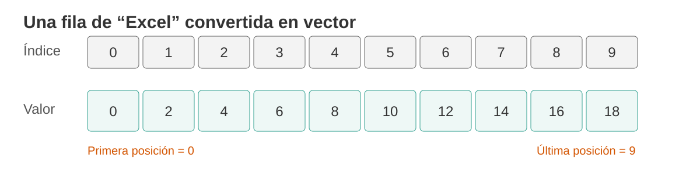
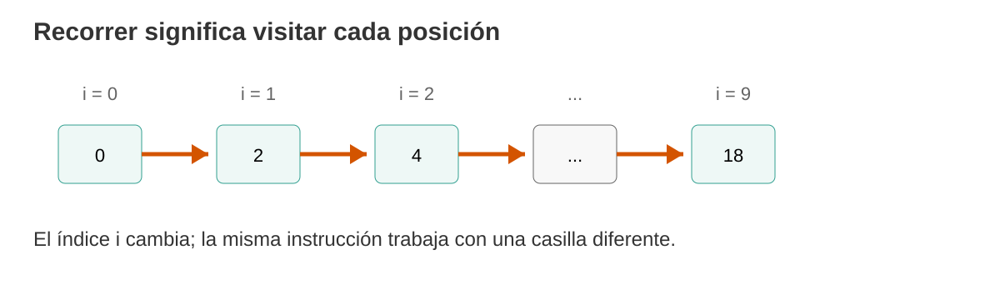
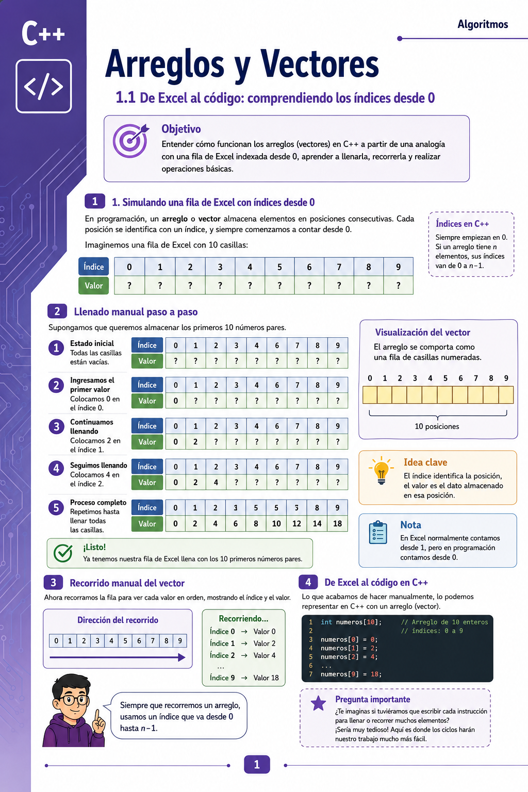

# El reto de hoy

Hasta ahora hemos trabajado con variables individuales:

```cpp
int nota1;
int nota2;
int nota3;
```

Esto funciona cuando tenemos pocos datos.

Pero imaginemos que necesitamos guardar las notas de **10, 50 o 100 estudiantes**.

::: {.callout-important}
## Pregunta para el grupo

¿Tendría sentido crear manualmente `nota1`, `nota2`, `nota3`... hasta `nota100`?

Hoy aprenderemos una forma diferente de organizar muchos datos del mismo tipo: **los arreglos o vectores**.
:::

# 1. Antes de programar: imaginemos una fila de Excel

Pensemos en una fila formada por **10 casillas**.

Pero haremos algo especial: en lugar de numerarlas del 1 al 10, las numeraremos como lo hace un arreglo en programación:

**0, 1, 2, 3, 4, 5, 6, 7, 8 y 9.**

{fig-alt="Fila de casillas numeradas desde cero, simulando un vector" width="96%"}

::: {.callout-tip}
## Idea clave

Si tenemos **10 casillas**, la primera posición es `0` y la última es `9`.

En general, si un arreglo tiene `n` elementos, sus posiciones van:

```text
0, 1, 2, ..., n - 1
```
:::

# 2. Dos conceptos que no debemos confundir

En cada casilla existen dos cosas diferentes:

- **Índice:** indica dónde está la casilla.
- **Valor:** es el dato almacenado dentro de esa casilla.

Por ejemplo:

| Índice | 0 | 1 | 2 | 3 | 4 |
|---|---:|---:|---:|---:|---:|
| Valor | 15 | 20 | 8 | 12 | 30 |

Entonces:

- en la posición `0` está almacenado `15`;
- en la posición `1` está almacenado `20`;
- en la posición `4` está almacenado `30`.

::: {.callout-note}
## Preguntemos

Si quiero obtener el valor `12`, ¿qué posición debo visitar?

La respuesta es la posición **3**, aunque visualmente sea la cuarta casilla.
:::

# 3. Llenemos las casillas manualmente

Supongamos que queremos almacenar los primeros diez números pares.

Al inicio tenemos:

| Índice | 0 | 1 | 2 | 3 | 4 | 5 | 6 | 7 | 8 | 9 |
|---|---:|---:|---:|---:|---:|---:|---:|---:|---:|---:|
| Valor | ? | ? | ? | ? | ? | ? | ? | ? | ? | ? |

Ahora llenemos una casilla a la vez:

| Paso | Índice visitado | Valor que colocamos |
|---:|---:|---:|
| 1 | 0 | 0 |
| 2 | 1 | 2 |
| 3 | 2 | 4 |
| 4 | 3 | 6 |
| 5 | 4 | 8 |
| 6 | 5 | 10 |
| 7 | 6 | 12 |
| 8 | 7 | 14 |
| 9 | 8 | 16 |
| 10 | 9 | 18 |

Al terminar:

| Índice | 0 | 1 | 2 | 3 | 4 | 5 | 6 | 7 | 8 | 9 |
|---|---:|---:|---:|---:|---:|---:|---:|---:|---:|---:|
| Valor | 0 | 2 | 4 | 6 | 8 | 10 | 12 | 14 | 16 | 18 |

# 4. Ahora recorramos la fila manualmente

**Recorrer** un arreglo significa visitar sus posiciones una por una.

{fig-alt="Recorrido secuencial de un vector usando un índice i" width="95%"}

Podríamos describir el proceso así:

```text
Visitar posición 0
Mostrar su valor

Visitar posición 1
Mostrar su valor

Visitar posición 2
Mostrar su valor

...

Visitar posición 9
Mostrar su valor
```

::: {.callout-note}
## ¿Observamos un patrón?

La acción siempre es la misma.

Lo único que cambia es la **posición** que estamos visitando.

Eso debería recordarnos algo que ya conocemos: **los ciclos**.
:::

# 5. De las casillas de Excel a un arreglo en C++

En C++ podemos representar nuestras diez casillas así:

```cpp
int numeros[10];
```

Leamos esta instrucción:

> Cree una estructura llamada `numeros` capaz de almacenar **10 valores enteros**.

Las posiciones disponibles serán:

```text
numeros[0]
numeros[1]
numeros[2]
numeros[3]
numeros[4]
numeros[5]
numeros[6]
numeros[7]
numeros[8]
numeros[9]
```

::: {.callout-warning}
## Atención

`numeros[10]` **no es una posición válida** en un arreglo de 10 elementos.

El `10` utilizado al declarar el arreglo representa su **cantidad de elementos**; sus índices válidos son de `0` a `9`.
:::

# 6. Hagamos exactamente lo mismo que hicimos a mano

Podemos llenar el arreglo manualmente:

```cpp
numeros[0] = 0;
numeros[1] = 2;
numeros[2] = 4;
numeros[3] = 6;
numeros[4] = 8;
numeros[5] = 10;
numeros[6] = 12;
numeros[7] = 14;
numeros[8] = 16;
numeros[9] = 18;
```

Y también podemos mostrarlo manualmente:

```cpp
cout << numeros[0] << endl;
cout << numeros[1] << endl;
cout << numeros[2] << endl;
cout << numeros[3] << endl;
cout << numeros[4] << endl;
cout << numeros[5] << endl;
cout << numeros[6] << endl;
cout << numeros[7] << endl;
cout << numeros[8] << endl;
cout << numeros[9] << endl;
```

::: {.callout-important}
## Hagamos una pausa

El arreglo ya resolvió un problema: no necesitamos crear diez variables con nombres diferentes.

Pero todavía estamos repitiendo muchas instrucciones.

**¿Qué estructura conocemos para repetir?**
:::

# 7. Aparece el ciclo `for`

Podemos utilizar una variable `i` para representar la posición actual:

```cpp
for (int i = 0; i < 10; i++) {
    cout << numeros[i] << endl;
}
```

Analicemos:

| Parte | Significado |
|---|---|
| `int i = 0` | comenzamos en la primera posición |
| `i < 10` | continuamos mientras exista una posición válida |
| `i++` | avanzamos a la siguiente posición |
| `numeros[i]` | accedemos al elemento que corresponde al índice actual |

::: {.callout-success}
## La conexión importante

El ciclo `for` no está haciendo algo mágico.

Está automatizando exactamente el recorrido que primero hicimos **manualmente**.
:::

# 8. Ahora llenemos el arreglo con un ciclo

En lugar de escribir diez asignaciones:

```cpp
for (int i = 0; i < 10; i++) {
    numeros[i] = i * 2;
}
```

Observemos algunas vueltas:

| `i` | Expresión `i * 2` | Casilla modificada |
|---:|---:|---|
| 0 | 0 | `numeros[0]` |
| 1 | 2 | `numeros[1]` |
| 2 | 4 | `numeros[2]` |
| 3 | 6 | `numeros[3]` |
| ... | ... | ... |
| 9 | 18 | `numeros[9]` |

# 9. Nuestro primer programa completo

```cpp
#include <iostream>
using namespace std;

int main() {

    int numeros[10];

    // Llenamos el arreglo
    for (int i = 0; i < 10; i++) {
        numeros[i] = i * 2;
    }

    // Recorremos y mostramos el arreglo
    for (int i = 0; i < 10; i++) {
        cout << "Posicion " << i
             << " = " << numeros[i] << endl;
    }

    return 0;
}
```

# 10. Ahora que los datos los ingrese el usuario

Podemos reutilizar el mismo recorrido:

```cpp
#include <iostream>
using namespace std;

int main() {

    int edades[5];

    for (int i = 0; i < 5; i++) {
        cout << "Ingrese la edad para la posicion " << i << ": ";
        cin >> edades[i];
    }

    cout << "\nDatos almacenados:" << endl;

    for (int i = 0; i < 5; i++) {
        cout << "edades[" << i << "] = " << edades[i] << endl;
    }

    return 0;
}
```

::: {.callout-note}
## Antes de ejecutarlo

Predigamos:

1. ¿Cuál será la primera posición utilizada?
2. ¿Cuál será la última?
3. ¿Cuántas veces se ejecutará cada `for`?
4. ¿Qué ocurriría si cambiamos `i < 5` por `i <= 5`?
:::

# 11. Hagamos operaciones con todos los elementos

Una vez que sabemos recorrer el arreglo, podemos procesar sus datos.

Por ejemplo, sumarlos:

```cpp
int suma = 0;

for (int i = 0; i < 5; i++) {
    suma = suma + edades[i];
}

cout << "Suma = " << suma << endl;
```

Y calcular el promedio:

```cpp
double promedio = suma / 5.0;

cout << "Promedio = " << promedio << endl;
```

::: {.callout-tip}
## Lo verdaderamente importante

Aprender arreglos no consiste únicamente en memorizar:

```cpp
int datos[10];
```

Lo importante es comprender tres acciones:

1. **crear** el arreglo;
2. **acceder** a una posición mediante su índice;
3. **recorrer** sus elementos para leerlos, modificarlos o procesarlos.
:::

# 12. Actividad guiada en clase

Trabajemos primero sin programar.

Tenemos el siguiente vector:

| Índice | 0 | 1 | 2 | 3 | 4 | 5 |
|---|---:|---:|---:|---:|---:|---:|
| Valor | 12 | 7 | 25 | 9 | 18 | 4 |

Respondamos:

1. ¿Cuál es el valor de la posición `0`?
2. ¿En qué posición está el valor `25`?
3. ¿Cuál es el último índice válido?
4. Si recorremos de izquierda a derecha, ¿en qué orden aparecen los valores?
5. ¿Cuál es la suma de todos los elementos?
6. ¿Cuál es el mayor valor?

Después escribamos un programa que almacene estos datos y los muestre usando un `for`.

# 13. Mini reto

Construya un programa que:

1. cree un arreglo para almacenar **5 notas**;
2. solicite las cinco notas al usuario;
3. muestre cada nota junto con su índice;
4. calcule la suma;
5. calcule el promedio.

::: {.callout-warning}
## Por ahora

No busquemos todavía la solución más sofisticada.

El objetivo es dominar la relación:

**casilla → índice → valor → recorrido → procesamiento**.
:::

# 14. Cierre de la clase

Hoy pasamos de una idea conocida —una fila de casillas— a una estructura fundamental de programación.

Podemos resumirlo así:

```text
Muchas variables relacionadas
        ↓
Un arreglo
        ↓
Cada elemento tiene un índice
        ↓
Los índices comienzan en 0
        ↓
Un ciclo permite recorrerlos
        ↓
Podemos leer, modificar y procesar todos los datos
```

::: {.callout-success}
## Si comprendimos esto, estamos listos para el laboratorio

En el laboratorio podremos trabajar con problemas donde el arreglo ya no solo almacene datos, sino que tengamos que:

- buscar valores;
- encontrar máximos y mínimos;
- contar elementos que cumplan una condición;
- calcular promedios;
- modificar posiciones;
- combinar arreglos con funciones y procedimientos.
:::

# 15. Para recordar

> **Un arreglo es un conjunto de elementos del mismo tipo almacenados bajo un mismo nombre y diferenciados por su posición.**

Y nuestra regla de oro:

> **Si hay `n` elementos, los índices válidos van de `0` a `n - 1`.**

# Síntesis visual del capítulo

A continuación se presenta una síntesis visual de los conceptos fundamentales
que hemos trabajado sobre arreglos y vectores.

{
  fig-alt="Resumen visual sobre arreglos y vectores en C++"
  width="100%"
}
